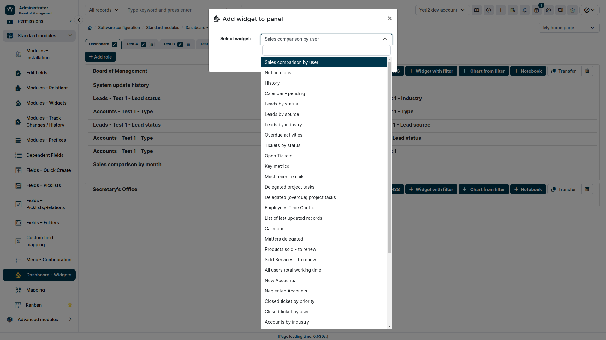

Widgety predefiniowane w YetiForce to gotowe do użycia elementy, które można umieścić na pulpicie nawigacyjnym systemu. Zostały one zaprojektowane przez zespół YetiForce i oferują szeroki zakres funkcji, które ułatwiają użytkownikom pracę z systemem.  W celu dodania nowego widgetu do pulpitu, należy wykonać następujące kroki:

### Konfiguracja 

W Panelu administracyjnym, z lewego menu wybierz **Moduły Podstawowe ➔ Panel - Widżety**

### 1. wybranie Pulpitu nawigacyjnego

Oprócz możliwości dostosowywania wyglądu i układu widgetów, YetiForce oferuje również funkcję tworzenia niezależnych pulpitów nawigacyjnych. Pozwala to na pogrupowanie widgetów tematycznie lub według własnych potrzeb, co ułatwia nawigację i dostęp do informacji.
Aby utworzyć nową zakładkę, należy kliknąć ikonę "+" (strzałka nr 5 na zrzucie ekranu) a następnie nadać pulpitowi nazwę. 

### 2. wybranie Roli

W YetiForce istnieje możliwość przypisywania widgetów do określonych ról użytkowników. Oznacza to, że widgety będą widoczne tylko dla użytkowników posiadających daną rolę.
Jeżeli na wybranym pulpicie nawigacyjnym, nie posiadamy jeszcze żadnego widgetu dla danej roli, wybieramy przycisk **+ Dodaj rolę** (strzałka nr 3 na zrzucie ekranu).

### 3. dodanie widgetu predefiniowanego

Po wybraniu pulpitu i roli, można dodać do niego widget predefiniowany za pomocą przycisku **Predefiniowane widgety**.
W zależności od wybranego widgetu, w oknie modalnym mogą pojawić się różne informacje, które należy skonfigurować, aby widget działał poprawnie.

Po przejściu do panelu użytkownika i wybraniu widoku Pulpitów, wybrany widget zostanie automatycznie umieszczony w odpowiednim miejscu. Możliwość przesuwania widgetów metodą "przeciągnij i upuść" pozwala na dowolną aranżację pulpitu i dostosowanie go do indywidualnych potrzeb. Układ widgetów na pulpicie jest zapisywany indywidualnie dla każdego użytkownika.
