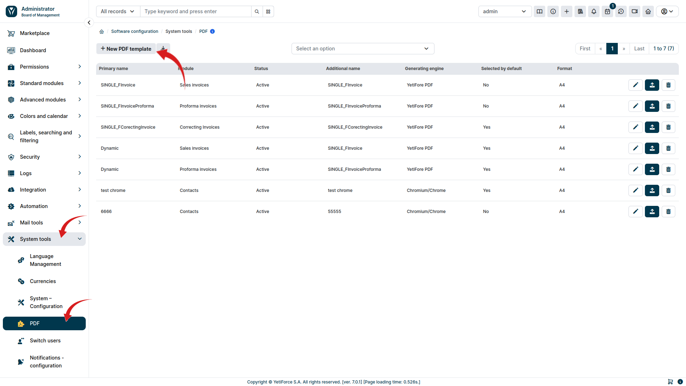
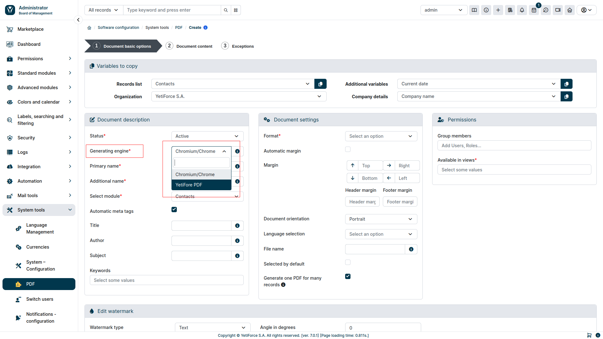

:::tip

Do prawidłowego działania PDF Premium konieczne jest wykupienie płatnego dodatku YetiForce PDF Premium. 

Instrukcja jak to zrobić znajduje się tutaj: [Instrukcja aktywacji YetiForce PDF Premium](/administrator-guides/marketplace/addons/YetiForce-pdf-premium/)

:::


W celu prawidłowego działania dodatku YetiForce PDF Premium, konieczne jest pobranie i zainstalowanie silnika Chromium/Chrome. Silnik ten umożliwia zaawansowane renderowanie PDF-ów, zapewniając wysoką jakość dokumentów i pełną zgodność z funkcjami systemu.

### Pobranie silnika Chromium/Chrome

Aby pobrać silnik Chromium odwiedź poniższą stronę. Znajdziesz tam instrukcje i linki do najnowszych wersji przeglądarki Chromium, które można zainstalować na swoim systemie.

- Chromium - https://www.chromium.org/getting-involved/download-chromium/

### Konfigurowanie ścieżki generatora PDF

Aby zapewnić prawidłowe generowanie dokumentów PDF w YetiForce CRM, konieczne jest skonfigurowanie ścieżki do generatora PDF. Proces ten obejmuje modyfikację pliku konfiguracyjnego i ustawienie odpowiedniej ścieżki do silnika Chromium/Chrome. Poniżej znajdziesz szczegółowe instrukcje dotyczące tej konfiguracji.

#### Lokalizacja pliku konfiguracyjnego

Plik konfiguracyjny odpowiedzialny za ustawienia generatora PDF znajduje się w katalogu **config/Components/** i nosi nazwę **Pdf.php**.

Plik konfiguracyjny PDF: [config/Components/Pdf.php](https://doc.yetiforce.com/code/classes/Config-Components-Pdf.html)

#### Ustawienie ścieżki do generatora PDF

W pliku **Pdf.php** znajdź parametr **[$chromiumBinaryPath](https://doc.yetiforce.com/code/classes/Config-Components-Pdf.html#property_chromiumBinaryPath)** i  ustaw w nim ścieżkę lokalną do zainstalowanego silnika Chromium/Chrome lub określić polecenie, które uruchamia ten silnik.


```php
/**
 * Configuration file: Config\Components\Pdf.
 */
class Pdf
{
    /**
     * The name or path of the chrome/chromium engine.
     *
     * @see https://www.chromium.org/getting-involved/download-chromium
     *
     * @var string
     */
    public static $chromiumBinaryPath = 'chromium';

    /**
     * Chromium browser options available for the browser factory.
     *
     * @see https://github.com/chrome-php/chrome#available-options
     *
     * @var array
     */
    public static $chromiumBrowserOptions = ['noSandbox' => true, 'noProxyServer' => true];
}
```

#### Przykładowe wartości `$chromiumBinaryPath`:

- chromium
- chromium-browser
- google-chrome
- /usr/bin/google-chrome
- c:\Program Files (x86)\Google\Chrome\Application\chrome.exe
- c:\ungoogled-chromium\chrome.exe

### Wybierz nowy silnik

W panelu administrcyjnym przejdź w lewym menu do zakładki  ```Narzędzia systemowe``` a następnie ```PDF```. W celu weryfikacji czy poprawnie skonfigurowano silnik Chromium/Chrome, wybierz przycisk ```Nowy szablon PDF```.



Gdy ścieżka `$chromiumBinaryPath` jest poprawnie ustawiona i system ma dostęp do lokalizacji/polecenia, zobaczysz nowy silnik w polu ```Silnik generujący```.



### Instalacja Chromium na Linuksie przy użyciu skryptu Bash

Upewnij się, że Twój system ma zainstalowane wszystkie wymagane zależności.
Dziękujemy [Puppeteer](https://github.com/puppeteer/puppeteer/blob/main/docs/troubleshooting.md#chrome-headless-doesnt-launch-on-unix)
❤

Lista wymaganych pakietów może się różnić w zależności od dystrybucji i wersji. [Lista zależności w zależności od wersji](https://source.chromium.org/chromium/chromium/src/+/main:chrome/installer/linux/debian/dist_package_versions.json)

Przykładowa komenda do instalacji zależności dla systemu Debian 12.4 bookworm

```bash
apt-get install -y --no-install-recommends libnss3-tools libatk1.0-0 libatk-bridge2.0-0 libdrm-dev libxkbcommon-dev libxcomposite1 libxdamage1 libxfixes3 libxrandr2 libgbm-dev libasound2 libcups2 libpango-1.0-0 libcairo2
```

Jeżeli twój system znajduje się na serwerze opartym o dystrybucję Linux, możesz w prosty sposób pobrać Chrome/Chromium za pomocą skryptu bash.

Wykonaj poniższy skrypt, który pobierze najnowszą wersję Chromium/Chrome i umieści go gotowego do pracy na serwerze w lokalizacji ```./latest```

```bash
#! /bin/bash

cd $(dirname $0)

LASTCHANGE_URL="https://www.googleapis.com/download/storage/v1/b/chromium-browser-snapshots/o/Linux_x64%2FLAST_CHANGE?alt=media"

REVISION=$(curl -s -S $LASTCHANGE_URL)

echo "latest revision is $REVISION"

if [ -d $REVISION ] ; then
  echo "already have latest version"
  exit
fi

ZIP_URL="https://www.googleapis.com/download/storage/v1/b/chromium-browser-snapshots/o/Linux_x64%2F$REVISION%2Fchrome-linux.zip?alt=media"

ZIP_FILE="${REVISION}-chrome-linux.zip"

echo "fetching $ZIP_URL"

rm -rf $REVISION
mkdir $REVISION
pushd $REVISION
curl -# $ZIP_URL > $ZIP_FILE
echo "unzipping.."
unzip $ZIP_FILE
popd
rm -f ./latest
find chromium/* -type d -ctime +1 -exec rm -rf {} \;
ln -s $REVISION/chrome-linux/ ./latest
```

<details>
  <summary>Rozwiazywanie problemów</summary>

- [#290](https://github.com/puppeteer/puppeteer/issues/290) - Debian <br/>
- [#391](https://github.com/puppeteer/puppeteer/issues/391) - CentOS <br/>
- [#379](https://github.com/puppeteer/puppeteer/issues/379) - Alpine <br/>

</details>