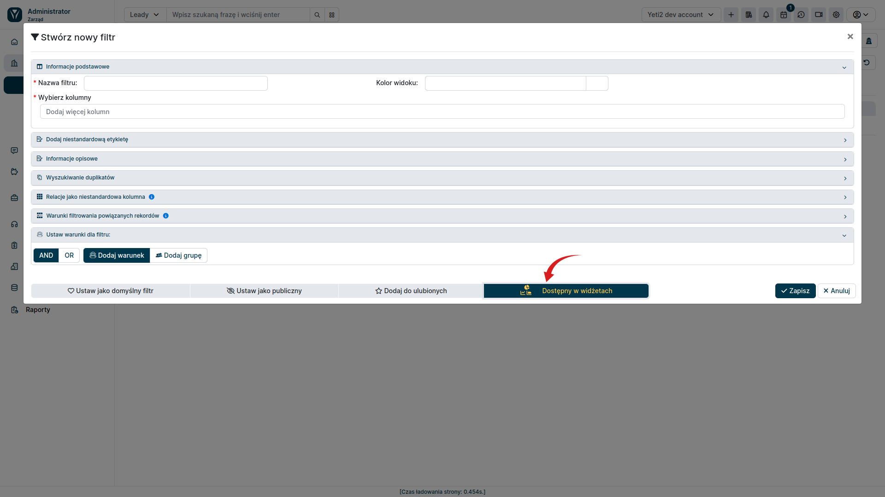
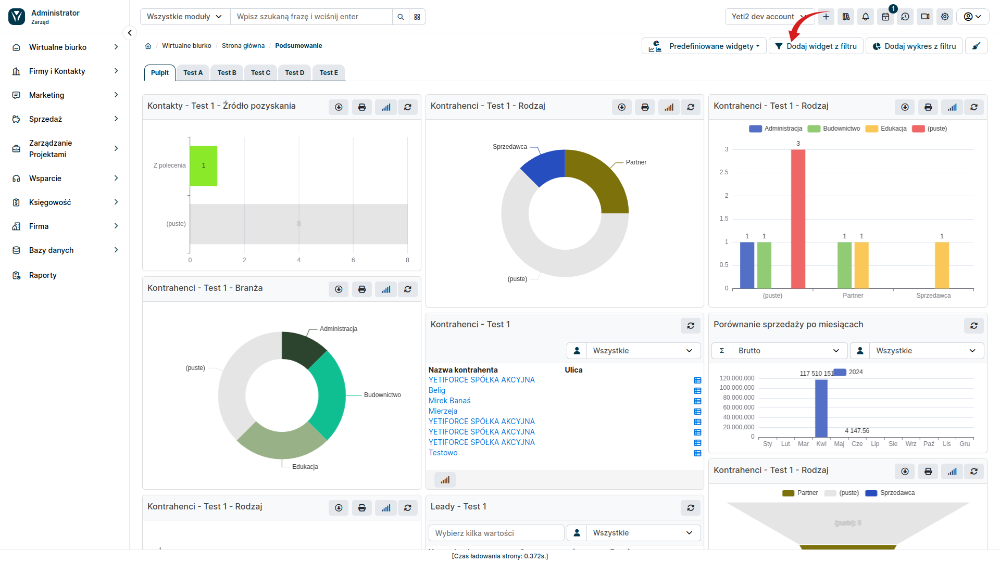

Oprócz predefiniowanych widgetów, YetiForce oferuje widgety oparte o filtry stworzone na listach. Pozwalają one na prezentację danych zgodnie z indywidualnie przyjętymi założeniami i ograniczeniami. 
Pozwala to dostosować widget konkretnie pod dane potrzeby, w momencie kiedy ogólne widgety predefiniowane nie są w stanie tego zrobić.

## 1. Tworzenie filtru
W panelu użytkownika przejdź do modułu, z którego chcesz pobrać dane do widgetu. Na przykład, jeśli chcesz utworzyć widget z filtrami dla leadów, przejdź do modułu "Leady".
Wybierz znajdująca się w centralnej części ekranu sekcję *Filtry* a następnie wybierz przycisk **Stwórz nowy filtr**

Po kliknięciu przycisku **Stwórz nowy filtr** w widoku listy, pojawia się okno modalne, które oferuje szeroki wachlarz opcji dostosowywania i filtrowania danych.

### Najważniejsze pola tworzonego filtru

* **Wybór kolumn**: Możesz określić, które kolumny z listy mają być wyświetlane w filtrze
* **Relacyjne dane**: Istnieje możliwość wyświetlania danych powiązanych z innych modułów w systemie. Na przykład, jeśli filtrujesz listę leadów, możesz wyświetlać dane z powiązanych kontaktów lub firm.
* **Warunki**: Możesz tworzyć złożone filtry stosując operatory AND i OR do łączenia różnych kryteriów. Pozwala to na precyzyjne filtrowanie danych i wyświetlanie tylko tych informacji, które Cię interesują.

By filtr był dostępny w widgetach, należy zaznaczyć opcję **Dostępy w widgetach**. Następnie możemy zapisać utworzony filtr i wykorzystać go w dowolnym widgecie.

## 2. Tworzenie widgetu

Widget z filtru można utworzyć w systemie YetiForce na dwa sposoby. 

### a) Tworzenie widgetu przez panel administracyjny 
W panelu administracyjnym z lewego menu wybierz **Moduły Podstawowe ➔ Panel - Widżety**.

Następnie dla odpowiedniego pulpitu i roli wybierz przycisk **Widget z filtrem**

W oknie modalnym, które się pojawi wybierz moduł zgodny z modułem, w którym został utworzony filtr i uzupełnij pozostałe informacje niezbędne do działania widgetu.

Następnie należy przejść w Panelu użytkownika do zakładki Pulpit i dodać widget wybierając go z listy, która się pojawi po naciśnięciu przycisku **Predefiniowane widgety** 

### b) Tworzenie widgetu przez panel użytkownika

Alternatywną metodą stworzenia widgetu z filtrów jest dodanie go z poziomu panelu użytkownika.
W tym celu przejdź do zakładki **Pulpit** a następnie wybierz przycisk **Dodaj widget z filtru**.

Podobnie jak to miało miejsce w podczas tworzenia widgetu przez Panel administracyjny, pojawi nam się okno modalne, w którym możemy ustalić szczegóły tworzonego widgetu.

